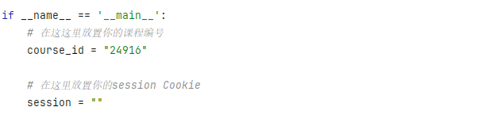
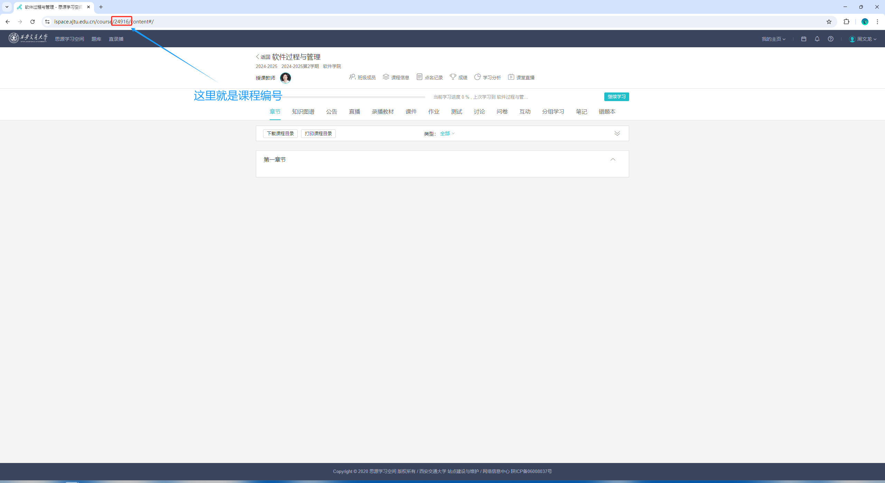
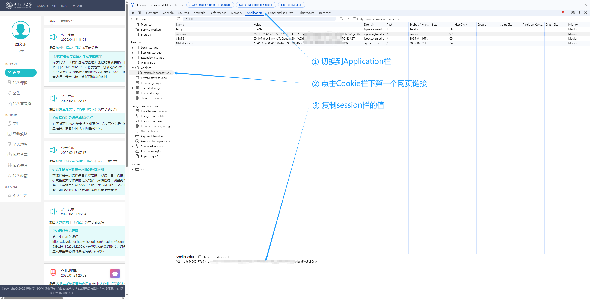
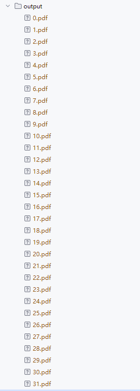
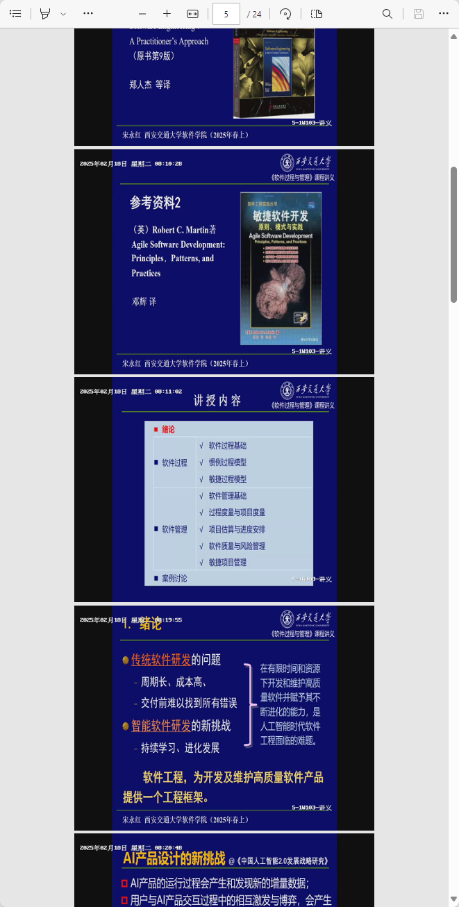

# XJTU-iSpace-SlideExtractor
老师不给ppt吗？自己在思源学习空间里提取！

## 项目简介
> 项目的格式来源于 [wangerforcs](https://github.com/wangerforcs)。

本项目是一个自动ppt自动提取系统，通过爬虫实现，通过对思源学习空间的录播分析提取出课程ppt


> ❗本项目功能已实现90%，欢迎提出PR改进

## 使用方法

### 安装依赖
```shell
pip install -r ./requirements.txt
```

### 放置课程编号和Cookie



### 获取课程编号

首先，登录 [思源学习空间](http://ispace.xjtu.edu.cn/) ( http://ispace.xjtu.edu.cn/ )，点进需要提取ppt的课程，如图获取课程编号，



将复制的课程编号输入项目中的course_id中

### 获取思源学习空间Cookie

登录 [思源学习空间](http://ispace.xjtu.edu.cn/) ( http://ispace.xjtu.edu.cn/ )，然后按`F12`打开开发者工具，并按如下操作复制cookie



将复制的cookie输入项目中的session中

### 运行项目

```shell
python SlideExtractor.py
```


运行完成后，提取的课程ppt会自动输出到output文件夹下🌈




### 提取效果

